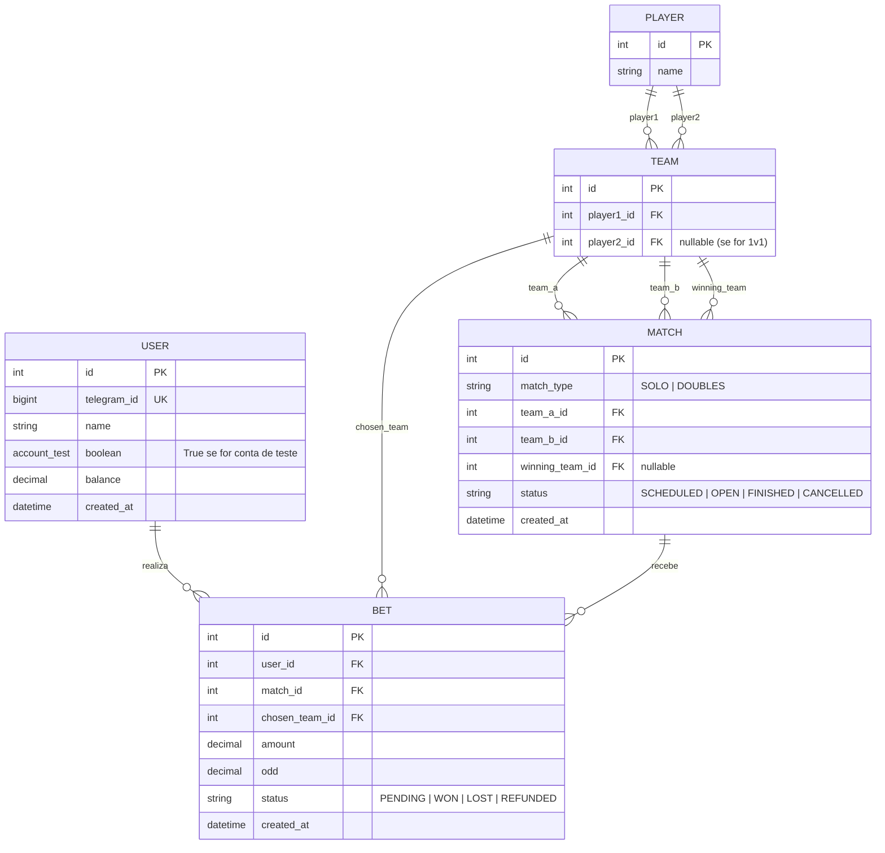

# PingBet

```mermaid
erDiagram
    USER ||--o{ BET : "realiza"
    USER {
        int id PK
        bigint telegram_id UK
        string name
        account_test boolean "True se for conta de teste"
        decimal balance
        datetime created_at
    }

    PLAYER ||--o{ TEAM : "player1"
    PLAYER ||--o{ TEAM : "player2"
    PLAYER {
        int id PK
        string name
    }

    TEAM ||--o{ MATCH : "team_a"
    TEAM ||--o{ MATCH : "team_b"
    TEAM ||--o{ MATCH : "winning_team"
    TEAM ||--o{ BET : "chosen_team"
    TEAM {
        int id PK
        int player1_id FK
        int player2_id FK "nullable (se for 1v1)"
    }

    MATCH ||--o{ BET : "recebe"
    MATCH {
        int id PK
        string match_type "SOLO | DOUBLES"
        int team_a_id FK
        int team_b_id FK
        int winning_team_id FK "nullable"
        string status "SCHEDULED | OPEN | FINISHED | CANCELLED"
        datetime created_at
    }

    BET {
        int id PK
        int user_id FK
        int match_id FK
        int chosen_team_id FK
        decimal amount
        decimal odd
        string status "PENDING | WON | LOST | REFUNDED"
        datetime created_at
    }       
```
